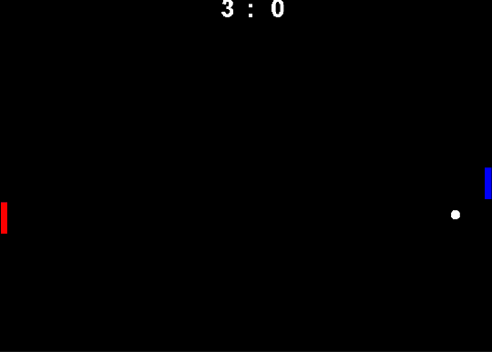

# Pong Game with Deep Q Networks (DQN)

## Overview

This is a Pong game implemented in Java. The left paddle (Red) was trained using Reinforcement Learning (DQN) to play by selecting one of three actions: moving UP, moving DOWN, or staying still for a given position of the ball. The right paddle (Blue) can be controlled manually using ↑ and ↓ arrows.


## Features

- **ML-Powered Paddle**: The Red paddle (left) is trained using DQN.
- **Adjustable Bot Type**: Players can choose between different bot types.
- **Two-Player Mode**: Allows manual control of both paddles.
- **Score Limit**: The game ends when a player reaches `MAX_POINTS`.

## Controls

- **Two-Player Mode (NONE):**

  - Red Paddle (Left): `W` (↑), `S` (↓)
  - Blue Paddle (Right): `↑` (Up Arrow), `↓` (Down Arrow)

- **Single Player Mode:**

  - `B0T_Type` can be set to ML (`DQN`) or a normal programmed bot (`PROGRAMMED`).
  - `B0T_Team` can be assigned to a normal bot. Since the ML bot was trained as the Red paddle, it won't work for the Blue paddle.

## Bot Configuration

You can set the bot type and team in the code:

```java
enum B0T_Type { DQN, PROGRAMMED, NONE }
enum Team { RED, BLUE, NONE }

public static B0T_Type B0T_Type = B0T_Type.DQN;
public static Team B0T_Team = Team.RED;
public static int MAX_POINTS = 10;
```

- `B0T_Type.DQN` - Uses the trained ML model (DQN) for paddle movement.
- `B0T_Type.PROGRAMMED` - Uses a predefined logic for the paddle.
- `B0T_Type.NONE` - Disables ML, enabling two-player mode.
- `B0T_Team.RED` - ML/Programmed bot controls the Red paddle.
- `B0T_Team.BLUE` - Programmed bot controls the Blue paddle.

## Dependencies

- Java Development Kit (JDK)

## Running the Game

1. Compile and run the Java program using :
   ```sh
   javac -d out -sourcepath src src/DQN/DQN.java
   java -cp out DQN.DQN
   ```
2. Adjust bot settings in the code if necessary.
3. Play against AI Bot, Programmed Bot or with another player!

Enjoy playing Pong with ML!
